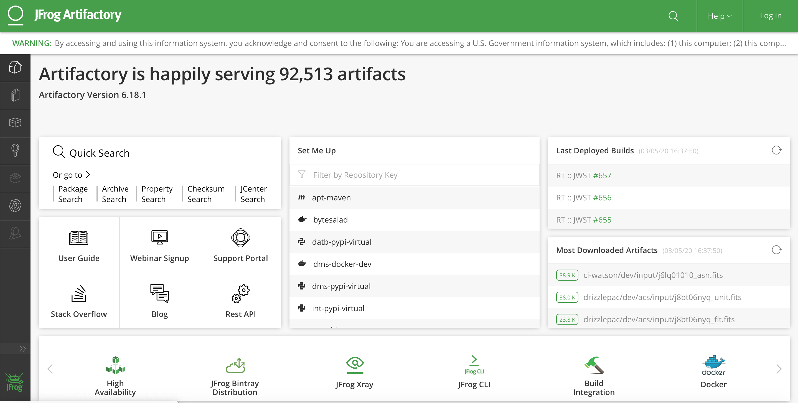
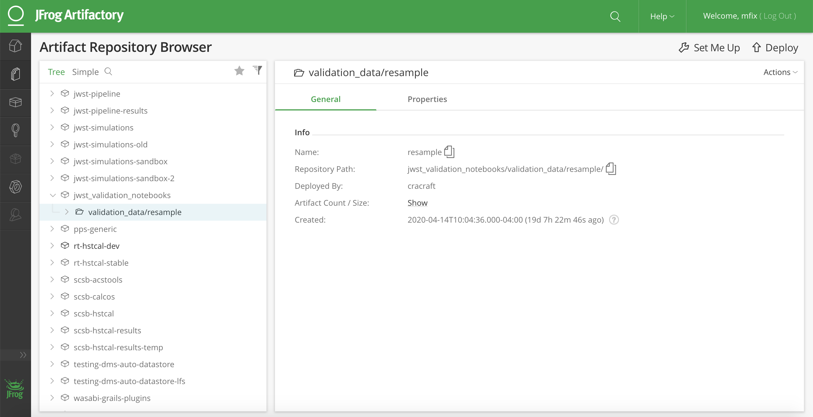
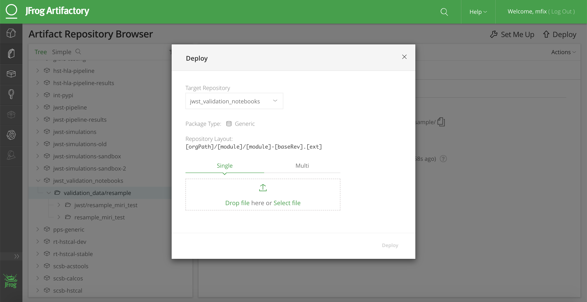
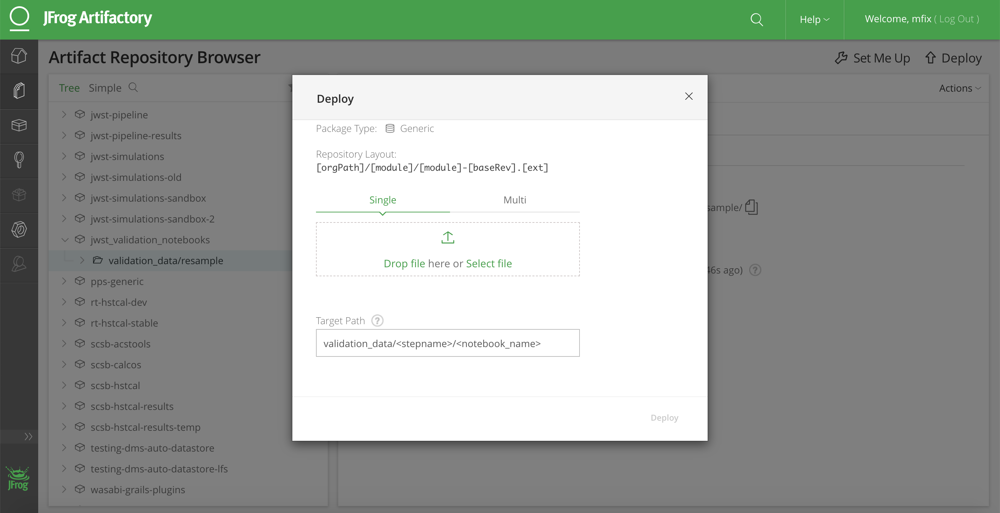
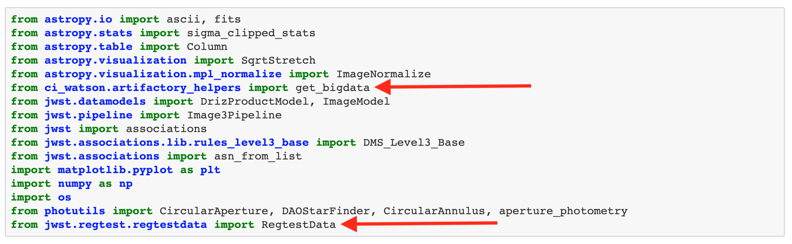
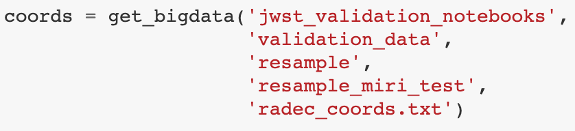
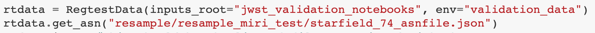
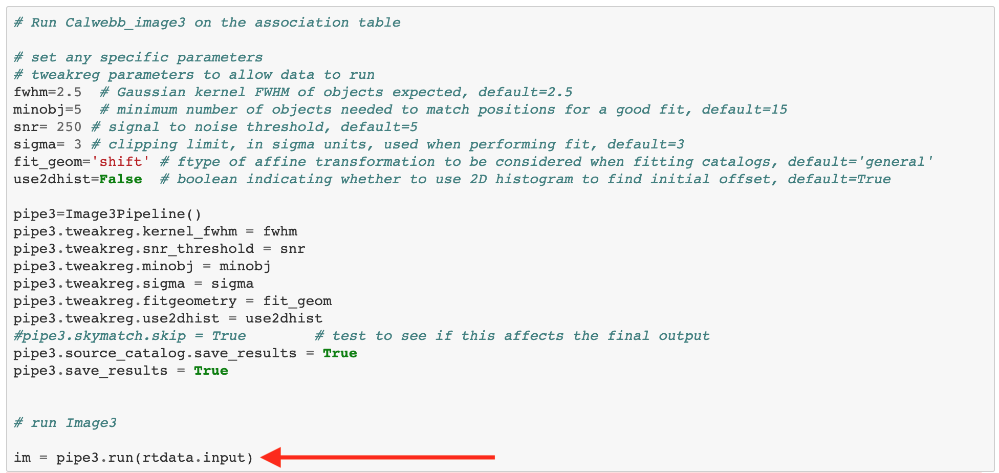

# JWST Validation Notebooks

This document serves as a reference for "how do I contribute" to the `jwst_validation_notebooks`. This process will change in the future but as for now, these are the steps that a contributor should follow.

## What are the JWST Validation Notebooks?

The JWST Validation Notebooks are a suite of Jupyter Notebooks written by JWST Instrument Team members that diagnose the "scientific validity" of how the pipeline is performing by using output such as tables and figures. These cannot be diagnosed by a pass or fail criteria like the tests including the testing suite of the JWST pipeline software (unit and regression tests) but by human inspection. The goal of this project is to provide the unexecuted notebooks in a version-controlled repository and generate `html` "screen shots" of the executed notebooks and serve them to the INS team member via a website in a cadence defined by the DMS working group. These notebooks contain code, markdown and figures to conveniently wrap testing into a one stop shop where all of these things can be shared for new pipeline builds. We would like to have a repeatable, reliable, and automated process to provide the teams with testing information to quickly turn around pipeline build testing requirements without having to generate and rerun the same tests and write ups manually.

## Contributing to the JWST Notebooks

Here is a general guide for contributing to the JWST Validation Notebooks

    1. Create a Notebook that follows the [Notebook Template](https://github.com/spacetelescope/jwst_validation_notebooks/blob/master/jwst_validation_notebooks/templates/validation_test_template.ipynb)
    2. Submit a Pull Request for review
    3. Contribute Data

### 1. Create a Notebook that follows the Notebook Template

First, create a fork of the repository and then clone your copy from your github repositories. The JWST Validation Notebooks follows the same directory tree structure as the [JWST Pipeline Software](https://github.com/spacetelescope/jwst/tree/master/jwst) where we break the tests up into the which step you are are interested in testing.

    $ git clone git@github.com:<my_username>/jwst_validation_notebooks.git
    $ git checkout -b <branchname> (choose a branch name that is descriptive 'add-miri-resample-notebook')
    $ cd jwst_validation_notebooks
    $ cd jwst_validation_notebooks
    $ ls

If you don't see the step you wish to test listed, make sure that you make the directory, copy the template, rename it with the following naming convention `jwst_<stepname>_<instrument_name>.ipynb` where `<stepname>` is the pipeline step you wish to test and the `<instrument_name>` is the instrument you are testing.

    $ mkdir <stepname>
    $ cd <stepname>
    $ cp ../templates/* .
    $ mv validation_test_template.ipynb jwst_<stepname>_<instrument_name>_test.ipynb

If you see the step listed, just follow the last three commands listed above. Now you can open the notebook

    $ jupyter notebook jwst_<stepname>_<instrument_name>.ipynb

and follow and update the sections accordingly.

### 2. Submit Pull Request for Review 

Once you have verified that you have your notebook running and documented, it's now time to add the notebook to our regression suite. Things to consider before submitting your pull request

    1. Did you install any dependencies that aren't listed in the requirements files?
    2. Did you clear the kernel and clear the output of your notebook? Before submitting?

### 3. Contribute Data

More than likely, your notebook will contain some hardcoded paths to your data. You will want to remove these and replace them will calls to artifactory. Our artifactory repository is located [here](https://bytesalad.stsci.edu/artifactory/webapp/#/artifacts/browse/tree/General/jwst_validation_notebooks) and you can request permission to add the data yourself or request that a maintainer with permissions add it for you.

I will outline the steps to contribute data via the artifactory website. First visit space telescope artifactory server at https://bytesalad.stsci.edu/
You will see a webpage that looks like the following with a panel of icons that runs vertically on the left-hand side of the webpage. You will want to select the artifacts icon (it looks like a stack of papers) circled in red below.

Once you select the artifacts icon, you will want to scroll down the panel on the left-hand side of the webpage until you reach the `jwst_validation_notebooks` repository. Once located, click the drop-down icon just to the left of the repository which will expose the child folders of the repository and click the `validation_data` folder which is circled in red below.

Next if you will need to locate the deploy button in the upper right-hand corner of the webpage. The icon is a wrench, use the figure above to locate it or locate it on your web browser and click it. Next, a dialog will appear that looks like the following

From here you can click `Select File` if you want to select the file path or you can click drag and drop file into the perforated box. After adding the data, scroll down where you will see the `Target Path` input box of the form. Here you will want to add the relavent path where you want the data to be store. Preferably you add the data to the folder named after the step name and notebook name you are trying to test. So, if you are adding a `dark_current` testing notebook, add the data you want to test to the `validation_data/dark_current/<notebook_name>` folder.

    NOTE: If the folder that you want to add doesn't exist, just type out the path you would like the data to live `<stepname>/file_i_am_adding.fits`. Also, if the file folder for the step you are testing exist, you can just click the names of the folder in the left-hand scroll bar of the webpages under validation_data and you won't have to add the Target Path by hand and will be handled for you.

Once you have your data and `Target Path` selected, click `Deploy` and the data is now hosted on artifactory!

#### Accessing the Data in the Notebook

Accessing the data from artifactory is easy with `ci_watson` or using the JWST Pipeline software. `ci_watson` is a package supported by STScI and allows users to easily interface and retrieve single data files. `jwst.regtest.regtestdata.RegtestData` allows user to retrieve an association file (`asn.json`) with the presumption that all of the members of the associated are located in the same file. Meaning, when you request `asn.json` file from artifactory using this method will also retrieve all of the files in the members table of the file. Below are two screen shots show the two different methods.

First, we import the packages, they are circled in red below

To get a single file from artifactory you make the call to `ci_watson`'s `get_bigdata`. The arguments are the folder names where the file is located. In this instance we are getting the file `radec_coords.txt` from `jwst_validation_notebooks/validation_data/resample/resample_miri_test/`.

If you are looking to retrieve all of the files in an association, we will use `jwst.regtest.regtestdata.RegtestData`.

This will download all of the files including the association and assign the association to the variable `rtdata`. You can then pass `rtdata.input` to the pipeline like below

