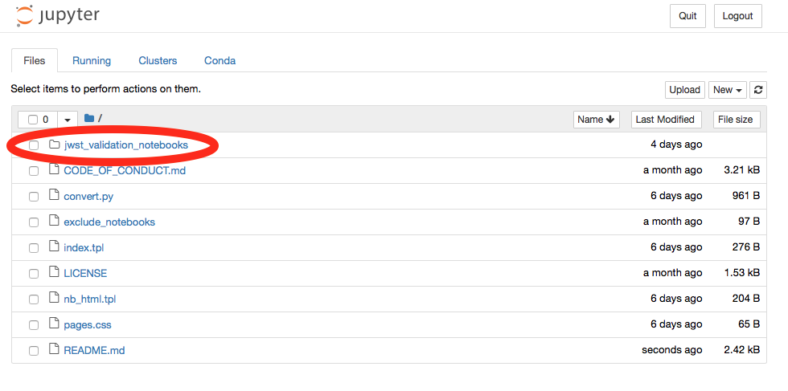
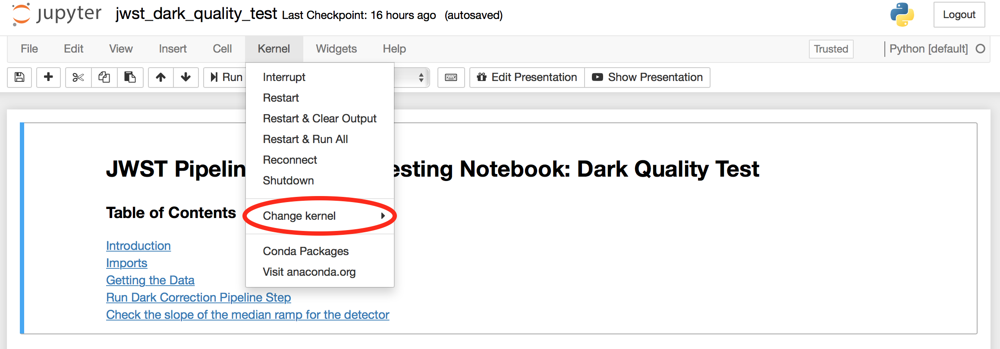

# JWST Validation Notebooks

This repository contains notebook that are used to validate the output of the JWST Calibration Pipeline. These notebooks are structured to capture documentation, code and figures and other outputs that will need to be inspected by eye by members of the JWST instrument teams.

These notebooks follow a consistent [style guide](https://github.com/spacetelescope/style-guides/blob/master/guides/jupyter-notebooks.md) in terms of layout/structure, coding conventions etc.

## Contents
To see the current notebook suite visit our [website](https://jwst-validation-notebooks.stsci.edu/).

## Executing Notebooks Locally

### Installing the JWST Calibration Pipeline ###
Visit the [JWST Pipeline Software](https://github.com/spacetelescope/jwst) for installation instructions.

### CRDS Setup ###

Inside the STScI network, the pipeline works with default CRDS setup with no modifications.  To run the pipeline outside the STScI network, CRDS must be configured by setting two environment variables:

    export CRDS_PATH=$HOME/crds_cache
    export CRDS_SERVER_URL=https://jwst-crds.stsci.edu

### Setting up Notebook Kernel ###

To activate and use your JWST conda environment in the notebook setting you will need to install `nb_conda` and `ipykernel`

    conda install nb_conda
    conda install ipykernel

Later, we will show how to change between the different kernels.

### Getting the Notebooks ###

Clone the repository:

    git clone https://github.com/spacetelescope/jwst_validation_notebooks.git
    cd jwst_validation_notebooks

### Opening and Running Notebooks ###

To start the jupyter enter:

    jupyter notebook

This will open the your web browser, here you can access the notebooks by selecting the `jwst_validation_notebooks` folder

from here you can select the specific testing directory and notebook. Jupyter Notebooks have extension `.ipynb`.

### Selecting Kernel ###

To change the kernel, use the Kernel drop down in the top left corner of the notebook and hover over "Change Kernel".

From here, you can select the conda environment kernel that has the JWST pipeline installed. Now you can execute the notebook
regularly. For commands on how to execute the cells look at the [Jupyter Notebook](https://jupyter-notebook.readthedocs.io/en/stable/) documentaion. Here is a useful [cheat sheet](https://cheatography.com/weidadeyue/cheat-sheets/jupyter-notebook/pdf_bw/) with shortcuts and commands.

### Running Notebooks with nbpages ###
First make sure you are in the `jwst-validation-notebooks` repository and execute the following commands:

    pip install nbpages
    python convert.py

This will generate the html output locally.

### Contributing New Notebooks & Data ###

This repository operates using the standard [fork and pull request github](https://gist.github.com/Chaser324/ce0505fbed06b947d962) workflow. Make sure to follow the template outlined in our repository [here](https://github.com/spacetelescope/jwst_validation_notebooks/blob/master/jwst_validation_notebooks/template/jwst_validation_test_template/validation_test_template.ipynb).