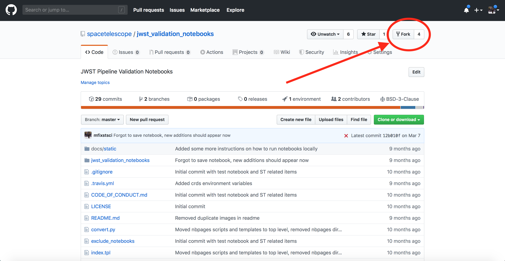
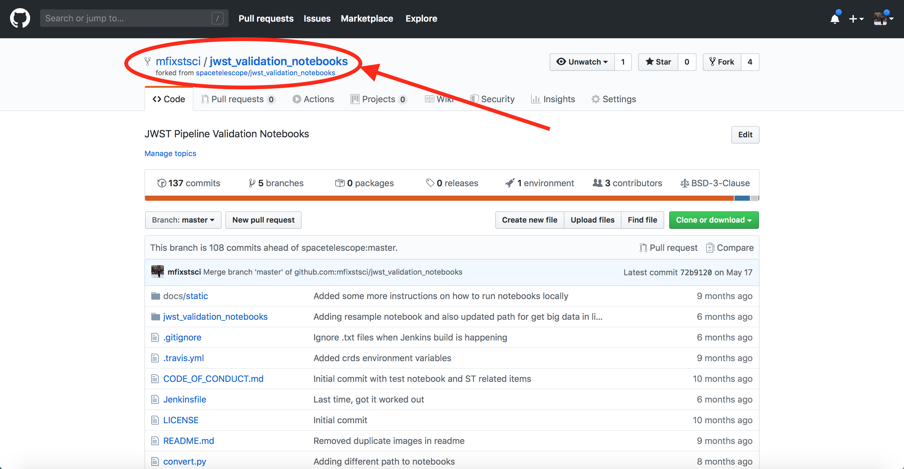
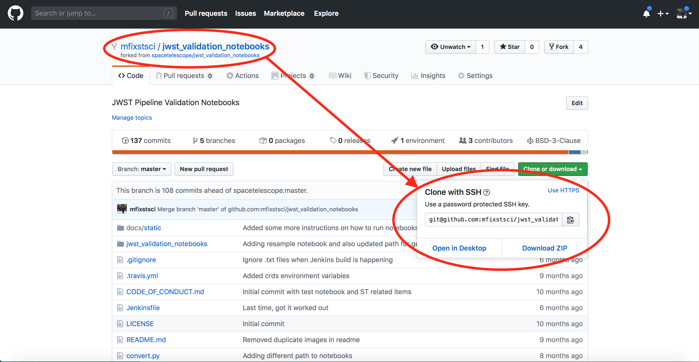
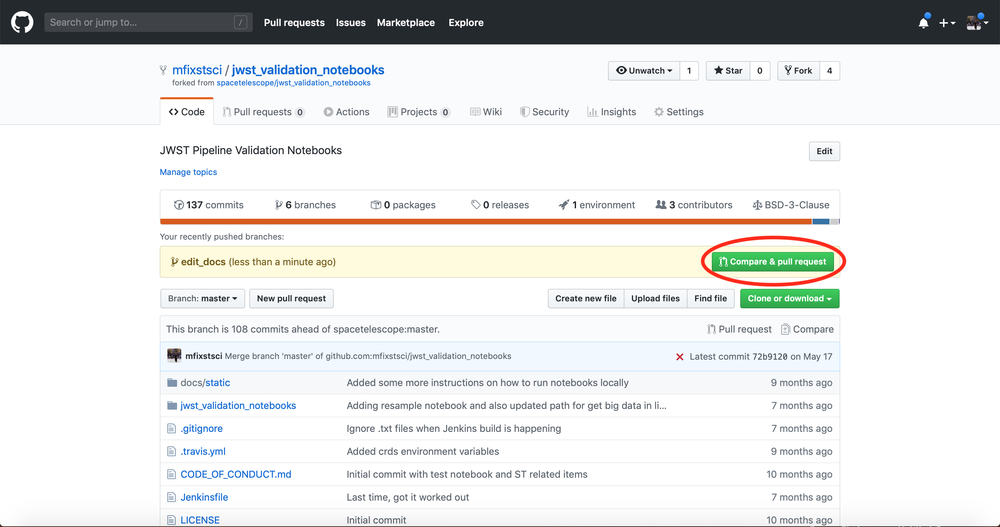
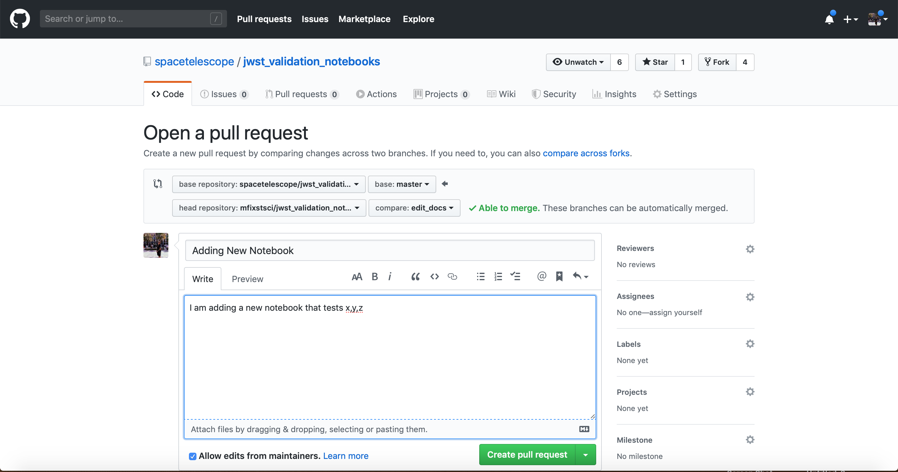

# JWST Validation Notebooks

This repository contains notebook that are used to validate the output of the JWST Calibration Pipeline. These notebooks are structured to capture documentation, code and figures and other outputs that will need to be inspected by eye by members of the JWST instrument teams.

These notebooks follow a consistent [style guide](https://github.com/spacetelescope/style-guides/blob/master/guides/jupyter-notebooks.md) in terms of layout/structure, coding conventions etc.

## Contents

This repository holds the notebooks themselves, but in a harder-to-read unexecuted form. If you want to view the notebooks online, you should view [the rendered versions](https://spacetelescope.github.io/jwst_validation_notebooks/).  At present this includes:

* CALDETECTOR 1
    * [Linearity Correction Residuals](https://spacetelescope.github.io/jwst_validation_notebooks/jwst_validation_notebooks/jwst_linearity_residuals_test/jwst_linearity_validation_testing.html)
    * [Dark Correction Quality](https://spacetelescope.github.io/jwst_validation_notebooks/jwst_validation_notebooks/jwst_dark_quality_test/jwst_dark_quality_test.html)

## Executing Notebooks Locally

### Installing the JWST Calibration Pipeline ###
To execute the notebooks locally, you must install the JWST Pipeline using [conda](https://conda.io/docs/index.html):

    conda create -n jwst --file <URL>
    source activate jwst

where `<URL>` is of the form:

    Linux: http://ssb.stsci.edu/releases/jwstdp/0.12.2/latest-linux
    OS X: http://ssb.stsci.edu/releases/jwstdp/0.12.2/latest-osx

### CRDS Setup ###

Inside the STScI network, the pipeline works with default CRDS setup with no modifications.  To run the pipeline outside the STScI network, CRDS must be configured by setting two environment variables:

    export CRDS_PATH=$HOME/crds_cache
    export CRDS_SERVER_URL=https://jwst-crds.stsci.edu

### Setting up Notebook Kernel ###

To activate and use your JWST conda environment in the notebook setting you will need to install `nb_conda` and `ipykernel`

    conda install nb_conda
    conda install ipykernel

Later, we will show how to change between the different kernels.

### Getting the Notebooks ###

Clone the repository:

    git clone https://github.com/spacetelescope/jwst_validation_notebooks.git
    cd jwst_validation_notebooks

### Opening and Running Notebooks ###

To start the jupyter enter:

    jupyter notebook

This will open the your web browser, here you can access the notebooks by selecting the `jwst_validation_notebooks` folder

from here you can select the specific testing directory and notebook. Jupyter Notebooks have extension `.ipynb`.

### Selecting Kernel ###

To change the kernel, use the Kernel drop down in the top left corner of the notebook and hover over "Change Kernel".

From here, you can select the conda environment kernel that has the JWST pipeline installed.

### Running Notebooks ###

Now that you have the notebook of your choice open with the proper kernel selected, you will want to execute the cells to perform your own tests. 
For commands on how to execute the cells look at the [Jupyter Notebook](https://jupyter-notebook.readthedocs.io/en/stable/) documentaion.
Here is a useful [cheat sheet](https://www.cheatography.com/weidadeyue/cheat-sheets/jupyter-notebook/pdf_bw/) with shortcuts and commands. 

### Contributing New Notebooks ###

This repository operates using the standard [fork and pull request](https://gist.github.com/Chaser324/ce0505fbed06b947d962) github workflow.
First you will want to fork the repository

When the forking process is done, you can look at the repositories under your username and will see a copy of the forked repository. Think "
I am forking a copy of the `jwst_validation_notebooks` repository from the `spacetelescope` profile to the `my_user_name`" profile.

Next, you will want to clone the newly forked repository

    Note: Look at the two circled areas of the github website, notice that we are cloning the repo under your username, not Space Telescope's

This forked repository is the where we will be commiting changes to, but we don't want to fully forget the Space Telescope repository.
While we are making changes to our local forked version, other developers can be submitting pull requests and merging code into the Space Telescope
validation notebook repository. We will link our forked by adding a new remote called `upstream`.

    git remote add upstream git@github.com:spacetelescope/jwst_validation_notebooks.git

Now, in your terminal enter

    git remote -v

and you should see your current remotes.

    origin	git@github.com:your_username/jwst_validation_notebooks.git (fetch)
    origin	git@github.com:your_username/jwst_validation_notebooks.git (push)
    upstream	git@github.com:spacetelescope/jwst_validation_notebooks.git (fetch)
    upstream	git@github.com:spacetelescope/jwst_validation_notebooks.git (push)

Next we will want to create a new branch, you will want to name it something clever like the name of the step you are contributing the notebook to or the name of the notebook. To make sure we practice what we preach, first we will fetch any possible changes before creating our new branch.

    git checkout master
    git fetch upstream
    git checkout -b my_new_branch_that_has_a_clever_name

Next you will want to change directories into `jwst_validation_notebooks` and then list the available contenet
using `ls`. If there is a directory named after the step you are interested in testing, move into that directory,
otherwise make the directory and name it after the step you are writing the test for using the `mkdir` command. 
Next, you will want to copy the notebook template from the template directory into your current directory and 
rename it.

    cp ../template/validation_test_template.ipynb
    mv validation_test_template.ipynb jwst_step_test.ipynb
    jupyter notebook jwst_step_test.ipynb

After you are finished writing your new notebook (following our style guide in the template) you will want
to commit your changes and create a pull request (PR). First add and commit you changes.

    git status (to see changes)
    git add jwst_step_test.ipynb
    git add ...
    git commit -m 'Adding a new notebook that is really cool'
    git push origin my_new_branch_that_has_a_clever_name

Now that the changes are pushed to your `origin` repository you will want to create a `pull request` against the
`upstream` repository. If you go to your forked copy of `jwst_validation_notebooks` you should seee a button
above the `clone & download` button that says `create a pull request`, click that button.

New you will need to add the title and a description of what you are contributing. Once you are done writing your
description, click `create pull request` and congratulations, you have just submitted your PR.

From here the maintainers of the repository can review your changes, 